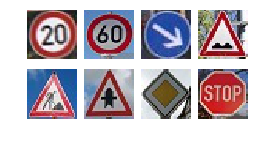

# Traffic-Sign-Classifier-Project

In this project, you will use what you've learned about deep neural networks and convolutional neural networks to classify traffic signs. Specifically, you'll train a model to classify traffic signs from the German Traffic Sign Dataset.

---

### 1. SETUP
Some issues getting Tensorflow-GPU working.
CUDA CuDNN vs. 5.1 dll required in CUDA folder
Restart of KERNEL necessary several times before CUDA was functioning.

### 2. Data import and visualization
Class sizes are very uneven from 60 to 750.
Attempt to augment dataset using tf.image.random_flip_up_down(image, seed=None) or tflearn.data_augmentation.DataAugmentation (self) unsuccessful
* Training Set:   34799 samples
* Validation Set: 4410 samples
* Test Set:       12630 samples
* Image Shape: (32, 32, 3)
* Number of classes = 43
* Largest class:  750
* Smallest class:  60

### 3. Data preparation
Grayscaling and normalization were helpful in bringing the accuracy from .87 to >.9

### 4. Network
The standard LeNet from the course was used with the necessary changes for 32*32 and the output to 43 classes.
Dropout was tested, but did not yield better performance (no overfitting yet?)
An improved LeNet was attempted but did not improve results. 

### 5. Training
Reducing the batch size down to 32 and increasing the EPOCHS to 200 was key to getting >.93 accuracy.
Setting the rate to rate = 0.0004 was also helpful to finetune the weights to the required >.93 accuracy
* EPOCHS = 200
* BATCH_SIZE = 32
* rate = 0.0004
* Hyperparameters left at default

### 6. Accuracy on test set
Final accuracy on the test data set showed an accuracy of .933
* Test Set Accuracy = 0.933

### 7. Accuracy on additional images sourced from Google Images.

* True Labels:      [0, 3, 38, 22, 25, 11, 12, 14]
* Predicted Labels: [ 0,  3, 38, 22, 25, 11, 12, 14]
* Accuracy: 1.0

### 8. Top 5 Hits per Google test images.
* Truth for image 0: 0. Top 5 predictions: [ 0  4  1  8 13]
* Truth for image 1: 3. Top 5 predictions: [ 3  2 10  5 31]
* Truth for image 2: 38. Top 5 predictions: [38  0  1  2  3]
* Truth for image 3: 22. Top 5 predictions: [22 29 25 20  0]
* Truth for image 4: 25. Top 5 predictions: [25 20 24 38 11]
* Truth for image 5: 11. Top 5 predictions: [11  0  1  2  3]
* Truth for image 6: 12. Top 5 predictions: [12  9 40 41 17]
* Truth for image 7: 14. Top 5 predictions: [14 25 38 36  5]

### 9. Activation of layers.
TF unable to find the names of my layers(e.g. conv1) probably missing some return function somewhere. No relevant documentation found.

### 10. Future improvements.
1. Augment sparse classes using TF or OpenCV (Rotation, transformation etc.)
2. Play further with batch sizes and learning rate
3. Re-enable dropout
4. Try alternate network architectures 
5. Get TensorBoard working to visualize network graph and get layer names
6. Show activation of different layers

### 11. Sources
* https://github.com/jeremy-shannon/CarND-Traffic-Sign-Classifier-Project/
* https://github.com/vburca/SDC-ND/blob/master/projects/p2-traffic_sign_classifier/
* https://github.com/udacity/CarND-Traffic-Sign-Classifier-Project

